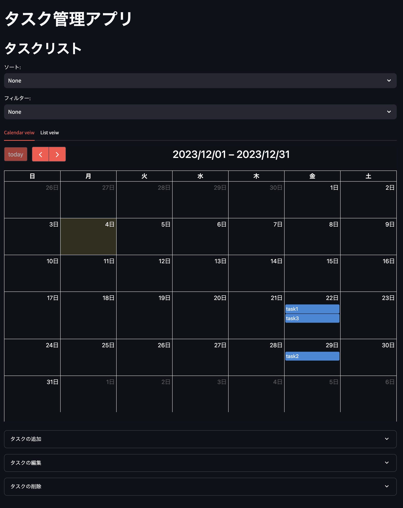

# web-app-check
## デモ


## 実行手順
```
git clone <this_repository>
cd web-app-check
pip install -r requirements.txt
streamlit run app.py
```
## コードの説明
`app.py`

ソースコード本体

`task.csv`

タスクを永続化するためのファイル

## 仕様

### タスクの一覧表示
 - 各項目に対して，ソートを行うことができる
 - カテゴリを利用し，フィルタリングを行うことができる
 - カレンダーにタスクを表示するカレンダービューとタスクの一覧を表示するリストビューが利用できる

### タスクの新規登録
 - タスクは，タイトルと詳細，優先度，カテゴリ，期限を設定できる
 - タスクのタイトルは，必須であり，他のタスクのタイトルと重複できない
 - タスクの優先度は，高・中・低が選択できる．
 - カテゴリの種類は，「カテゴリを追加」から追加できる

### タスクの編集・削除
- それぞれの項目を編集できる
- 登録したタスクを削除することができる

## コメント
- 数時間で実装したため，実装しきれなかった機能がいくつかある．
- 例えば，各タスクにready, doing, doneなどの進捗状況を示すタグあると便利である．
- また，カレンダービューやリストビューから＋ボタンを押すだとして，直感的にタスクの追加や編集・削除ができるようにしたいと考える．